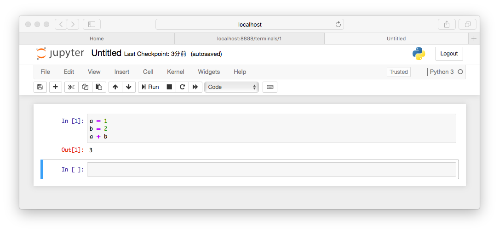

# Pythonメモ

## 環境構築
### macOS
- Homebrew

  https://brew.sh/index_ja

- Python
```sh
brew install python
```

- 動作確認
```sh
python3
```

### Windows


## パッケージ管理ツール
### 使い方
```sh
pip3 install xxx
```
### パッケージ一覧
- 手動で作成
```sh
echo 'パッケージ' >> requirements.txt
```

- 全パッケージ情報を含んだ一覧の作成
```sh
pip freeze > constraints.txt
```

- パッケージ一覧による一括インストール
```sh
pip3 install -r requirements.txt -c constarints.txt 
```

## 仮想環境
```sh
# 作成
mkdir basis
python3 -m venv basis

# 有効化
source basis/bin/activate

# 無効化
deactivate
```

## 対話モード
- 「python」とタイプしてEnter

### 電卓としての利用
```sh
>>> 1 + 2 * 4
9
>>> 5 / 10 + 1
1
```

### 変数の代入
```sh
>>> a = 18 + 4
>>> b = 3 - 1
>>> a + b
24
```

### 関数電卓としての利用
- mathという標準ライブラリをimportする
```sh
>>> import math
>>> math.sin(1) # 三角関数
0.8414709848078965
>>> math.pi # 円周率
3.141592653589793
```

### IPython
- 高機能RPEL (Read-Eval-Print-Loop = 対話型実行環境)
#### インストール方法
```sh
pip install ipython
```
#### 起動方法
```sh
$ ipython

...(省略)...

In [1]:
```
- In[X]:(Xは数字)のあとに新しい入力を開始する。

#### よく使われる機能
##### イントロスペクション
- オブジェクトの調査機能
```sh
In [1]: a = 2                                                   In [2]: a? # オブジェクトのあとに?をつける
Type:        int
String form: 2
Docstring:  
int([x]) -> integer
int(x, base=10) -> integer
```

- ??をつけるとより詳細な情報を確認できる場合もある。

##### シェルシステムへのアクセス
```sh
In [1]: !echo "Hello World!"                                    Hello World!
```

##### マジックコマンド
- %または%%から始まる特殊コマンド
###### %quickref
- マジックコマンドのクイック・リファレンス
###### %debug
- デバッガの起動
###### %env
- システム環境変数の取得
###### %history
- コマンドの実行履歴の表示
###### %load
- Pythonのソースコードの読み込み
###### %logstart、%logstop
- ログの取得
###### %macro
- マクロの定義
###### %pdoc
- docstring(後述)の表示
###### %reset
- IPythonのリセット
###### %timeit
- 実行時間の計測
###### %xdel
- 変数の削除

### Jupyter Notebook
- ブラウザ上でIPythonによる対話的なシェル環境を提供するWebアプリケーション
- インストール
```sh
pip install jupyter
```
- 起動
```sh
jupyter notebook
```


## 基本的な書き方
### 文の書き方
- 改行が文(statement)の区切り。
- 複数行に渡って文を記述する場合は、行末に\(バックスラッシュ)を記述。
- ()、[]、{}の途中で改行となる場合はバックスラッシュを省略可能。

### コメント
#### 1行コメント
```py
x = 1 # xの定義
y = 2 # yの定義

# zの定義
z = x + y
```
- 行の始めのほかに、コードの後ろに記述することもできる。

#### 複数行コメント
- """でかこむ
- docstringと呼ばれる文字列定義を利用した記述方式。
- モジュール、関数、クラスを定義するときに、仕様内容をこの形式で記述する。
- APIドキュメントにも利用される。
```py
def test_func(a, b)
  """test_func
  This is test func.

  :param a: numerical object
  :param b: numerical object
  :return: sum of a and b
  """
  return a + b
```

### データ型
#### 主なデータ型
##### int
- 整数値型
##### float
- 倍精度浮動小数点数
##### bool
- 真偽値型。TrueとFalseのいずれかの値を取る。
##### str
- 文字列型
##### list
- リスト型。ミュータブルな順番付きオブジェクト集合。
##### tuple
- タプル型。イミュータブルなオブジェクト集合。
##### set
- ミュータブルな順序のないオブジェクト集合。
##### dict
- 辞書型。順序のないkey-value型のオブジェクト集合。
##### bytes
- 8ビットの要素を持つイミュータブルなバイト配列型
##### bytearray
- ミュータブルなバイト配列型

#### 補足
- リスト型、タプル型、辞書型のオブジェクトはコンテナオブジェクトという。ほかのデータ型のオブジェクトの集合で構成される。

#### データ型の確認
- type()を使う
```sh
>>> a = 1
>>> type(a)
<class 'int'>

>>> b = 'test'
>>> type(b)
<class 'str'>
```
- intとstrの演算はできない
```sh
>>> a + b
Traceback (most recent call last):
  File "<stdin>", line 1, in <module>
TypeError: unsupported operand type(s) for +: 'int' and 'str'
```
- 変数aを文字列型に変換すると文字列結合になる。
```sh
>>> str(a) + b
'1test'
>>> 
```

#### ミュータブルなオブジェクト、イミュータブルなオブジェクト
##### イミュータブルなオブジェクト
- 定義したあとに、そのオブジェクトの要素を変更できない型
```sh
>>> a = (1,3)
>>> a[0] = 1
Traceback (most recent call last):
  File "<stdin>", line 1, in <module>
TypeError: 'tuple' object does not support item assignment
```
- tupleはイミュータブルなので、一度定義した変数の要素を変更しようとするとエラーになる。

##### ミュータブルなオブジェクト
- 定義したあとに、そのオブジェクトの要素を変更できる型
```sh
>>> b = [1,2,3,4]
>>> b[2] = 5
>>> b
[1, 2, 5, 4]
```
- listはミュータブルなので、一度定義した変数の要素を書き換えられる。

### 制御フロー
### 関数
### クラス
### 名前空間とスコープ

## Pythonと科学技術計算
### 科学技術計算
- データを対象
- 数式を用いた解析
- 数式を用いたシュミレーション

### 求められること
- マシンリソースの効率的な利用
- 高速な処理
- 可読性
- メンテナンス性

### Pythonの特徴
- それ自体での高速なプログラムは難しい場合がある。
- 他のプログラミング言語で記述されたコンポーネントと結合しやすい（グルー（糊）言語）
- 様々なデータソースとのデータ連携
- ビジュアライゼーション
- 科学技術計算に適した言語

### 主要な科学技術計算パッケージ
#### SciPy Stack
- Pythonによる科学技術計算の中核をなすパッケージ群
##### NumPy
- 多次元配列を用いた効率的な数値計算のためのパッケージ
##### SciPy Library
- 高度な科学技術計算のためのパッケージ
##### Matplotlib
- グラフ描画のためのパッケージ
##### IPython
- 高度な機能を持つ対話型シェル
##### pandas
- 効率的なデータ処理のためのパッケージ
##### Sympy
- CAS(Computer Algebra System、計算機代数システム)のような記号計算を行うパッケージ
##### nose
- テストフレームワーク

